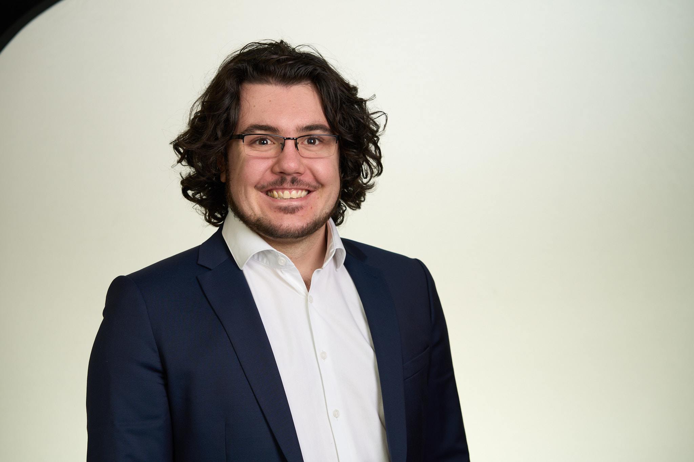

## Meet the CEO
:::: {.columns .ceo-section}

::: {.column width="40%"}
{width="100%"}
:::

::: {.column width="60%"}
Matyas is the visionary behind Terrier Supply Chain Consulting LLC. With several years of industry experience, he is dedicated to delivering top-tier solutions and ensuring every client achieves their goals.

Feel free to reach out to discuss how we can help your business thrive.
:::

::::

## Our Story

Terrier Supply Chain Consulting LLC was founded with a simple goal: to help businesses improve the way they manage their operations, supply chains, and day-to-day processes through practical, results-driven consulting.

After earning my Master's degree in Supply Chain Management from Boston University, I gained hands-on experience working on complex consulting engagements through both my academic capstone project and professional consulting work with companies across a variety of industries. These experiences revealed a common challenge—many small and growing businesses lacked access to tailored supply chain and operational expertise that could help them streamline processes, strengthen procurement, improve inventory management, and operate more efficiently.

Having grown up between two cultures and built my career in a third, I have also come to appreciate the importance of cultural awareness in business. Every organization operates within its own culture, and understanding the people, communication styles, and business practices behind an operation is just as important as understanding its processes. I believe that meaningful operational improvements come from solutions that are not only efficient but also aligned with the way a business and its people work.

Recognizing this need, and driven by a passion for solving operational challenges, I established Terrier Supply Chain Consulting LLC to provide businesses with personalized consulting solutions grounded in real-world experience, analytical thinking, cultural understanding, and a commitment to measurable improvement. I approach every engagement collaboratively, taking the time to understand each client's unique operations and deliver practical recommendations that create lasting value and support long-term growth.

## Our Mission

Our mission is to help businesses build stronger, more efficient operations through practical supply chain expertise, data-driven solutions, and collaborative problem-solving. We strive to deliver tailored improvements that optimize processes while recognizing that every successful solution begins with understanding each client's unique business, people, and culture.
